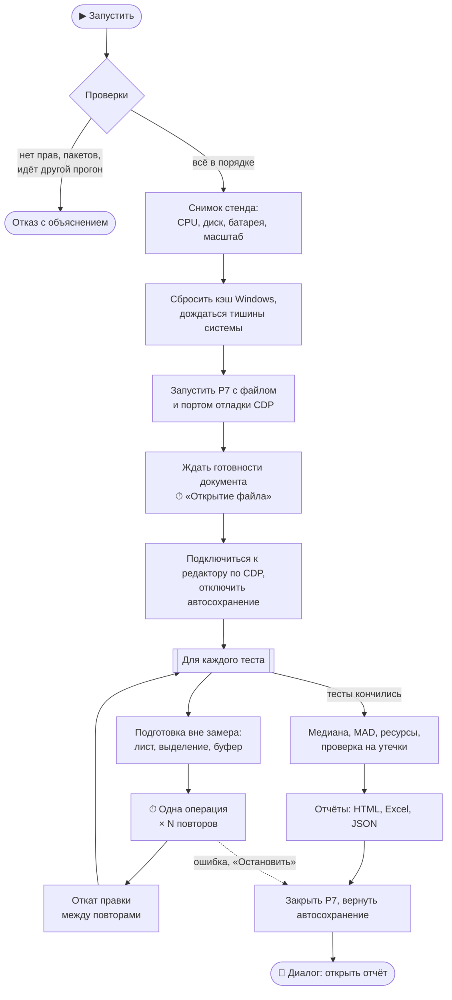
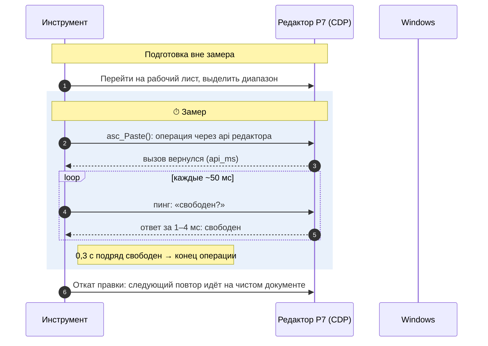
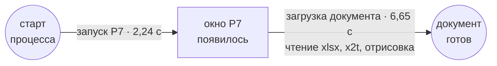
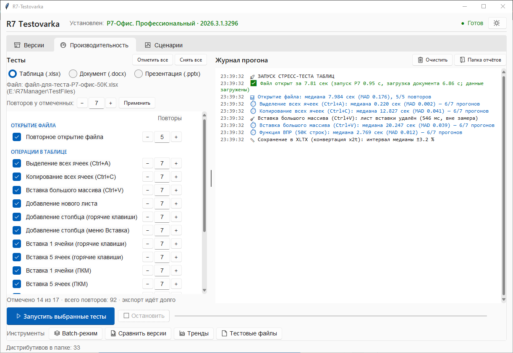
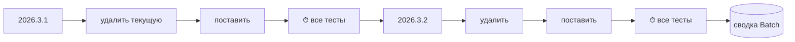
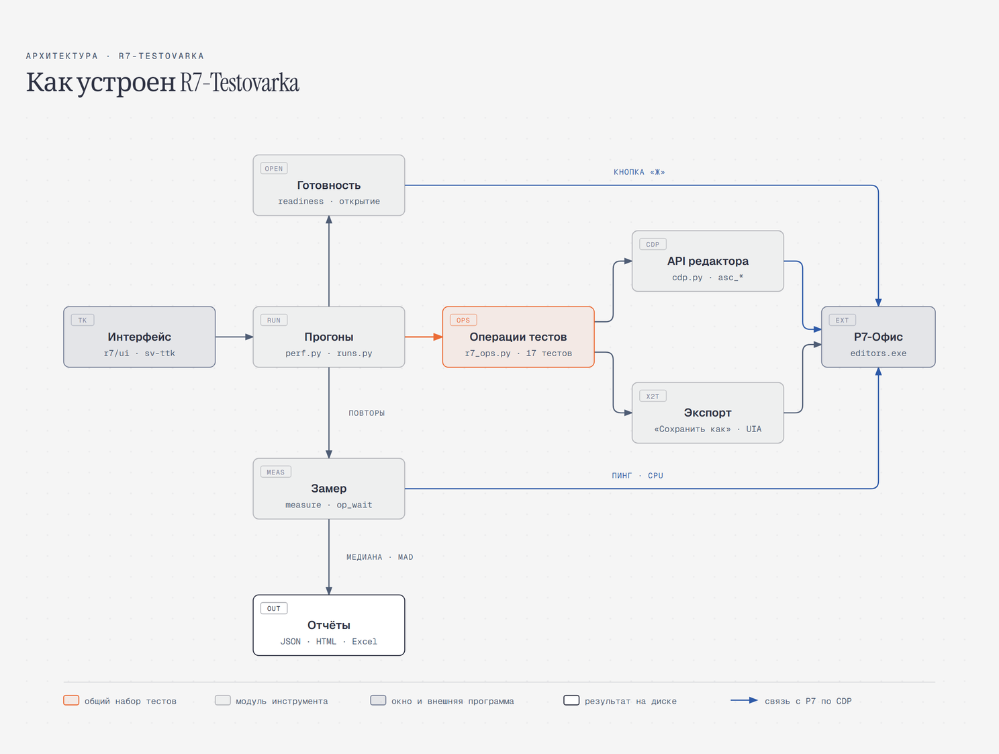

<div align="center">

# ⚡ R7-Testovarka

**Замеры производительности табличного редактора Р7-Офис: честные, повторяемые, сравнимые между версиями**

[](https://github.com/fedintsevqq/r7-testovarka/actions/workflows/tests.yml)
[](https://github.com/fedintsevqq/r7-testovarka/actions/workflows/build.yml)


</div>

R7-Testovarka ставит нужную версию Р7-Офис, открывает рабочий файл на 50 тысяч строк и
повторяет одни и те же операции: выделение, копирование, вставку, ВПР, экспорт в PDF, ODS,
CSV и XLTX. По каждой операции считает медиану и разброс, сравнивает версии между собой и
показывает тренд от прогона к прогону.

Главное правило: **цифра отражает работу Р7, а не инструмента.** Свои паузы инструмент
вычитает, конец операции берёт по ответу редактора, а не по последнему нажатию клавиши,
подготовку теста делает вне замера.

## Содержание

- [Что умеет](#-что-умеет)
- [Быстрый старт](#-быстрый-старт)
- [Как проходит прогон](#-как-проходит-прогон)
- [Как меряется одна операция](#-как-меряется-одна-операция)
- [Открытие файла: запуск Р7 и загрузка документа](#-открытие-файла-запуск-р7-и-загрузка-документа)
- [Режимы работы](#-режимы-работы)
- [Тесты](#-тесты)
- [Отчёты и как их читать](#-отчёты-и-как-их-читать)
- [Безопасность прогона](#-безопасность-прогона)
- [Как устроен код](#-как-устроен-код)
- [Проверки качества](#-проверки-качества)
- [Ограничения и частые вопросы](#-ограничения-и-частые-вопросы)

## ✨ Что умеет

| | |
|---|---|
| 📦 **Версии** | Видит установленную версию в реестре, ставит и удаляет дистрибутивы из `Distributives/`, проверяет их хеш-суммы |
| ⏱️ **Замер** | 17 тестов: открытие файла, 12 операций правки, 4 экспорта через конвертер x2t. Каждый повторяется 3–7 раз |
| 🔁 **Batch** | Проходит тесты по нескольким версиям подряд: удалить → поставить → замерить → дальше |
| 📊 **Сравнение** | 2–8 прогонов на одной странице, вердикт по критерию Манна-Уитни: регрессия, ускорение или «без изменений» |
| 📈 **Тренды** | История каждой операции по всем прогонам, с полосой разброса |
| 📄 **Свой файл** | Генератор тестовых xlsx и замер открытия и ВПР на любом вашем файле |
| 🌙 **Ночной прогон** | Скрипт сам прогоняет ключевые тесты и сравнивает с прошлой ночью |
| ⌨️ **Командная строка** | `python -m r7 run --suite suites/smoke.toml`: набор тестов из TOML с бюджетами, страница «Релиз готов / Не готов», JUnit XML и код выхода для CI |

## 🚀 Быстрый старт

**Что нужно:** Windows 10 или 11, Python 3.11–3.14 (64-бит), Р7-Офис 2026.x. Права
администратора желательны, но не обязательны: без них замеры идут, только файловый кэш
Windows перед открытием не сбрасывается (отчёт это помечает) и версии не ставятся.

```bat
git clone https://github.com/fedintsevqq/r7-testovarka.git
cd r7-testovarka
python -m venv .venv
.venv\Scripts\python.exe -m pip install --require-hashes -r requirements.lock
```

Версии пакетов зафиксированы в `requirements.lock` вместе с хешами. Список зависимостей —
`requirements.in`; после его правки lock пересобирают командой из `requirements.txt`.

Запускать **от имени администратора**:

```bat
.venv\Scripts\python.exe r7_Testovarka.py
```

> [!TIP]
> Двойной щелчок по `r7_Testovarka.py` тоже работает: если файл открыл системный Python
> без нужных пакетов, программа сама перезапустится под `.venv`. Готовый `.exe` собирается
> по инструкции [`BUILD.md`](BUILD.md).

**Без Python:** в [Releases](https://github.com/fedintsevqq/r7-testovarka/releases) лежит
архив `R7-Testovarka-<версия>-win64.zip` — `.exe`, папки и
[страница первого запуска](docs/rollout/README-first-run.md). Распаковать и запустить от
администратора; тестовый файл создаётся кнопкой «📄 Тестовые файлы».

**Рабочий файл:** `TestFiles/r7-test-50k.xlsx` — 50 000 строк × 50 столбцов. Если его нет,
создайте кнопкой «📄 Тестовые файлы»: при этих размерах генератор сам подставит это имя.
Прежнее имя `файл-для-теста-Р7-офис-50К.xlsx` программа тоже узнаёт, переименовывать
не нужно.

**Первый запуск:** программа сама проверяет стенд и показывает список: сборка, права,
Р7-Офис найден (если нет, то где искали), Р7 закрыт, порт CDP свободен, тестовый файл на
месте, свободное место, масштаб экрана, пакеты Python. Красные пункты мешают прогону,
жёлтые попадут в «Условия прогона» отчёта. Исправили, нажали «Повторить проверку». Флажок
«Больше не показывать» пишет `"first_run_done": true` в `r7_settings.json` рядом с
программой. В том же файле можно задать `r7_path` (путь к `DesktopEditors.exe`, он выше
реестра), `reports_folder` (папка отчётов) и `default_runs` (повторы по умолчанию).
Подробнее: [`docs/first-run.md`](docs/first-run.md).

**Первый прогон:** закройте Р7-Офис → вкладка «⚡ Производительность» → отметьте тесты →
«▶ Запустить выбранные тесты». Пока идёт прогон, не трогайте клавиатуру и мышь: инструмент
работает с окном Р7. Аварийный выход: увести мышь в левый верхний угол экрана.

## 🔄 Как проходит прогон



Р7 закрывается **при любом исходе**: штатно, по «Остановить» или после исключения.
Отчёт по уже сделанным операциям сохраняется всегда.

## ⏱ Как меряется одна операция

Секундомер останавливается не на последнем нажатии клавиши, а когда Р7 действительно
закончил работу. Нажатие клавиши лишь кладёт событие в очередь и возвращается сразу, и
«время операции» раньше было временем самого скрипта.



**Как определяется конец операции:**

| Путь | Признак конца | Точность |
|---|---|---|
| **CDP** (основной) | редактор отвечает на пинг быстрее 10 мс в течение 0,3 с подряд | ~1 мс |
| **Клавиши** (запасной, без CDP) | окно отвечает и CPU процессов Р7 ниже 25 % одного ядра 6 опросов подряд | ±0,2 с |
| **Экспорт** | файл появился на диске и перестал расти; конец берётся по времени записи | по `mtime` |

**Что вычитается и что нет:**
- Свои паузы инструмента (ожидание отрисовки меню или диалога) копятся в `_pace` и
  вычитаются: Р7 в это время ждёт нас.
- Подготовка теста, откат правки и ожидание после операции в замер не входят.
- Если повтор не подтвердился (редактор не сообщил, что документ изменился), повтор
  помечается и **в медиану не входит**.

**Статистика:** время считается медианой повторов, разброс показывает MAD (медианное абсолютное отклонение).
Первый повтор считается прогревом и отбрасывается, если после него остаётся хотя бы три.
Подробно: [`docs/measurement.md`](docs/measurement.md) и [`docs/precision.md`](docs/precision.md).

## 📂 Открытие файла: запуск Р7 и загрузка документа

Открытие делится на две фазы. В отчёте это выглядит так:
`8,89 с: запуск Р7 2,24 с, загрузка документа 6,65 с`.



| Фаза | От | До | Что показывает |
|---|---|---|---|
| **Запуск Р7** | старт процесса | появилось окно Р7 | скорость старта самого редактора, от файла почти не зависит |
| **Загрузка документа** | появилось окно | документ готов к работе | разбор xlsx, конвертация, отрисовка; растёт с размером файла |

**Документ готов**, когда Р7 перестал работать, а не когда кончилось наше ожидание.
Основной признак: на панели стала доступна кнопка «Жирный» (её видно через CDP). Запасной
признак: простой CPU процессов Р7. Перед каждым открытием инструмент сбрасывает файловый
кэш Windows: каждое открытие идёт с диска, как первое после перезагрузки. Подробно:
[`docs/readiness.md`](docs/readiness.md).

> [!NOTE]
> В файлах отчётов поля по-прежнему называются `cold_start_ms` и `warm_start_ms`, чтобы
> старые отчёты и тренды читались без изменений.

## 🖥 Режимы работы

### 📦 Вкладка «Версии»


Показывает установленную версию (из реестра) и дистрибутивы из папки `Distributives/`.
«Установить» удаляет текущую версию и тихо ставит выбранную. «Проверить хеш-суммы»
считает MD5 и SHA256 и сверяет с эталонами из `hashes.json`. Пока идёт любой замер,
установка недоступна.

### ⚡ Вкладка «Производительность»



Слева тесты по группам, у каждого своё число повторов. По умолчанию открытие повторяется
5 раз, операции правки 7 раз, экспорты 3 раза. Выбор сохраняется между запусками.
«Остановить» прерывает прогон между операциями, отчёт по сделанному всё равно сохраняется.

### 🔁 Batch-режим

Проходит те же тесты по нескольким версиям подряд: удаляет текущую, ставит следующую,
меряет, переходит дальше. Повторов 6, у экспортов 3. Есть «Пауза», «Остановить» и
«останавливаться при первой ошибке». Итог: сводная страница по версиям.



### 📄 Тестовые файлы и свой файл

Генератор создаёт xlsx нужного размера (от 1 000 до 1 000 000 строк, до 100 столбцов) с
профилями нагрузки: плоские данные, формулы, стили, смесь. «Протестировать» меряет
открытие и ВПР по всем строкам любого выбранного файла.

### 📊 Сравнение и 📈 тренды

В окне «Сравнить версии» выберите 2–8 отчётов и базовую версию. «Тренды» строят графики каждой
операции по всем сохранённым прогонам. Примеры в разделе [отчёты](#-отчёты-и-как-их-читать).

**Оформление.** Интерфейс в стиле Windows 11 (тема [Sun Valley](https://github.com/rdbende/Sun-Valley-ttk-theme)),
тёмный или светлый. Переключатель: кнопка с солнцем в правом верхнем углу, выбор
запоминается. Журнал прогона раскрашен по смыслу: ошибки, предупреждения, успех и итоги
операций выделены своими цветами, время строки приглушено.

> [!IMPORTANT]
> Одновременно идёт только один прогон: вкладка, Batch, свой файл и установка работают с
> клавиатурой Р7 и не могут мешать друг другу.

## 🧪 Тесты

| Группа | Тест | Как выполняется |
|---|---|---|
| **Открытие** | Повторное открытие файла | полный цикл: сброс кэша → запуск → готовность → закрытие |
| **Правка** | Выделение всех ячеек (Ctrl+A) | `asc_EditSelectAll` |
| | Копирование всех ячеек (Ctrl+C) | `asc_Copy` |
| | Вставка большого массива (Ctrl+V) | `asc_Paste`, после него откат |
| | Добавление нового листа | `asc_addWorksheet` |
| | Добавление столбца (горячие клавиши / меню Вставка) | `asc_insertCells` или пункт меню по подписи |
| | Вставка 1 и 5 ячеек (горячие клавиши / ПКМ) | клавиши или контекстное меню через DOM |
| | Функция ВПР (50K строк) | формулы на каждую строку одной операцией |
| | Удаление столбца (Del) | столбец B целиком, результат сверяется по ячейкам |
| **Экспорт x2t** | PDF, ODS, CSV, XLTX | «Сохранить как» → тип файла через UI Automation → файл на диске |

Каждая операция проверяется: редактор сообщает, изменился ли документ, и для вставки,
ВПР, удаления результат сверяется по значениям ячеек. Если CDP недоступен, тесты правки
идут клавишами (запасной путь, [`docs/ui-fallback.md`](docs/ui-fallback.md)).

## 📑 Отчёты и как их читать

После прогона в `Reports/` появляются три файла:

| Файл | Зачем |
|---|---|
| `Performance_Report_<время>.html` | страница для человека: плитки, график, таблица, детали повторов |
| `Performance_Report_<время>.xlsx` | те же данные в Excel |
| `performance_full_<время>.json` | полные данные для сравнения версий и трендов |


**Плитки сверху:**
- **Открытие файла** с разбивкой на запуск Р7 и загрузку документа.
- **Пик CPU** в процентах одного ядра (451 %: заняты четыре с половиной ядра), под ним
  та же цифра в доле всей машины: «28 % всех 16 ядер».
- **Доверие к цифрам** зелёное, если все повторы подтверждены; иначе плитка показывает, сколько таймаутов
  и неподтверждённых повторов.

**Метки у операций:**

| Метка | Значит |
|---|---|
| `таймаут×N` | Р7 не освободился за 180 с, повтор в медиану не входит |
| `без подтверждения×N` | редактор не подтвердил, что операция выполнилась, повтор исключён |
| `зависимые повторы` | правку не удалось откатить, следующий повтор шёл на изменённом документе |
| `<порога` | операция быстрее, чем можно измерить клавишами |
| `диск` | открытие замедлил медленный диск с папкой данных Р7 |

**Условия прогона** показывает жёлтая плашка: фоновая загрузка системы, работа от батареи, мало
места, чужое окно перехватило фокус, другая программа записала в буфер обмена.

### Сравнение версий


Страница начинается с вывода: сколько регрессий и ускорений и где. Вердикт «РЕГРЕССИЯ»
или «УСКОРЕНИЕ» ставится, только если разница **статистически значима** (критерий
Манна-Уитни, p < 0,05) **и больше 10 %**. Нужно не меньше пяти повторов на версию, иначе вердикт
«недостаточно прогонов».

### Тренды


> [!WARNING]
> Когда методика замера меняется, растёт номер схемы (`measure_schema` в JSON, сейчас 9).
> Отчёты разных схем напрямую не сравниваются: сравнение и тренды об этом предупреждают.

## 🛡 Безопасность прогона

Инструмент сам нажимает клавиши, поэтому у него жёсткие правила:

| Правило | Зачем |
|---|---|
| Клавиши идут только в окно процесса Р7, проверка перед каждым нажатием | заголовка «Р7-Офис» мало: он бывает и во вкладке браузера |
| Нужный диалог не открылся: исключение вместо слепого ввода | `Ctrl+V` или `Enter` не уйдут в чужое окно |
| В «Сохранить изменения?» нажимается только «Не сохранять», по тексту кнопки | кнопка по умолчанию перезаписала бы эталонный файл |
| Р7 закрывается при любом исходе, автосохранение возвращается | следующий прогон не упрётся в занятый порт |
| Изменяющий шаг CDP идёт последним в цепочке, повтор клавишами разрешён, только если документ не тронут | правка не применится дважды |

## 🧩 Как устроен код



Интерактивная версия схемы: [`docs/diagrams/architecture.html`](docs/diagrams/architecture.html).

| Модуль | Что в нём |
|---|---|
| `r7_ops.py` | все операции тестов, один набор для вкладки, Batch и своего файла |
| `r7/measure.py` | цикл повторов, статусы повторов, статистика |
| `r7/op_end.py`, `r7/op_wait.py` | конец операции: пинг редактора, CPU, файл экспорта |
| `r7/readiness.py`, `r7/readiness_wait.py`, `r7/bold_button.py` | готовность документа после открытия |
| `r7/cdp.py`, `r7/test_prep.py` | операции через api редактора, подготовка тестов, откат |
| `r7/export.py`, `r7/x2t_files.py` | экспорт через «Сохранить как», учёт конвертера x2t |
| `r7/windows.py`, `r7/processes.py`, `r7/dialogs.py`, `r7/close_wait.py` | окна и процессы Р7, клавиши, закрытие |
| `r7/stats.py`, `r7/compare_files.py` | Манн-Уитни, сравнение прогонов, поиск утечек |
| `r7_reports.py`, `templates/html/` | HTML-отчёты: модель страницы и шаблоны Jinja2 |
| `r7/ui/` | интерфейс Tk |

Правила для разработчика и полная карта кода лежат в [`CLAUDE.md`](CLAUDE.md), подробности по
темам в [`docs/`](docs/).

## ✅ Проверки качества

| Проверка | Команда | Время |
|---|---|---|
| Юнит-тесты (1 265 тестов, Р7 не нужен) | `.venv\Scripts\python.exe -m pytest -q` | ~25 с |
| Живой набор на установленном Р7 | `set R7_LIVE=1` и `.venv\Scripts\python.exe -m pytest -m live tests/live -v` | ~1,5 мин |
| Быстрый ночной прогон со сравнением | `.venv\Scripts\python.exe tests/nightly_local.py --quick` | ~8 мин |
| Набор без окна, вердикт «Релиз готов / Не готов», JUnit для CI ([`docs/cli.md`](docs/cli.md)) | `.venv\Scripts\python.exe -m r7 run --suite suites\smoke.toml --gate --junit Reports\junit.xml` | ~5 мин |

- **CI на GitHub:** юнит-тесты на Python 3.11 и 3.14, pyflakes, покрытие не ниже 85 %
  (сейчас 88 %), сборка `.exe` с самопроверкой.
- **Живой набор** прошёл 30 запусков подряд без провала.
- **Ночной прогон** завершается с кодом 2, если хоть одна операция дала регрессию, поэтому его
  можно поставить в Планировщик заданий Windows.

- **Перед раздачей команде:** чеклист проверки на чистых ПК, [`docs/rollout-checklist.md`](docs/rollout-checklist.md).

> [!CAUTION]
> Не запускайте живые прогоны и юнит-тесты одновременно: тесты интерфейса создают окна Tk и
> могут увести фокус у окна Р7. Перед живым прогоном закройте Р7-Офис.

## ❓ Ограничения и частые вопросы

**Известные ограничения**
- **Экспорт рабочего файла в ODS** роняет конвертер x2t: ему не хватает встроенного лимита
  памяти. Это баг Р7 (DE-8304), инструмент только фиксирует падение.
- **Открытие зависит от диска** с папкой данных Р7 (`%LOCALAPPDATA%\R7-Office`). На
  медленном диске часть открытий идёт заметно дольше, такие повторы помечены «диск».
- **Без пакетов `requests` и `websocket-client`** нет CDP. Тесты тогда идут клавишами, их
  цифры несравнимы с обычным прогоном, а тесты через контекстное меню не выполняются.

**Если что-то пошло не так**

| Что видно | Что делать |
|---|---|
| В журнале `WEBDRIVER_OK=False` | пакеты стоят не в том Python: `.venv\Scripts\python.exe -c "import requests, websocket"` |
| «Р7 уже запущен» | закройте Р7-Офис: к открытому процессу инструмент не подключается |
| Операция «зависла» | через 180 с она получит метку «таймаут», и прогон пойдёт дальше |
| Р7 остался открытым после ошибки | так не должно быть, пришлите журнал прогона |
| Программа упала или окно закрылось | всё, что было в журнале, и ошибки интерфейса лежат в `Reports/logs/r7-testovarka.log` (жёсткое падение — в `crash.log` рядом); пришлите этот файл |

---

<div align="center">

Лицензия: [MIT](LICENSE) · Документация: [`docs/`](docs/) · Презентация: [`docs/slides/r7-testovarka.html`](docs/slides/r7-testovarka.html) · Сборка `.exe`: [`BUILD.md`](BUILD.md)

</div>
