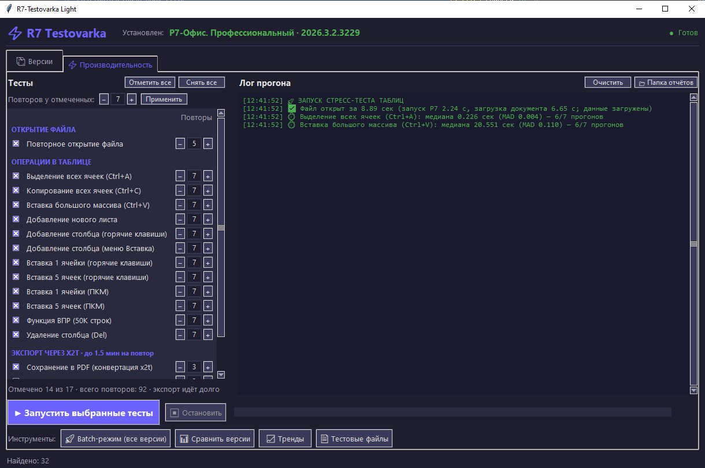
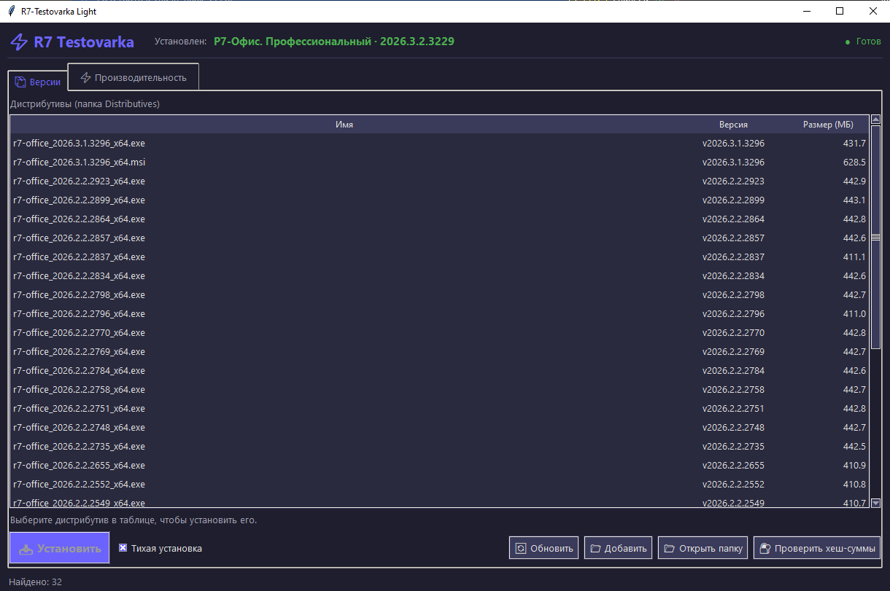
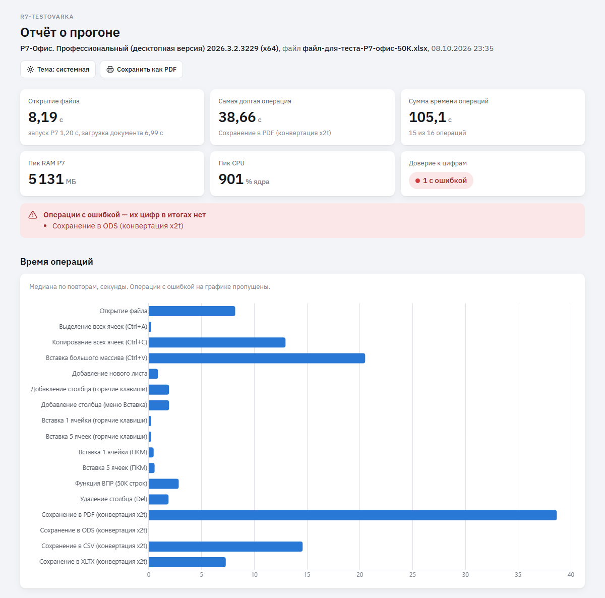
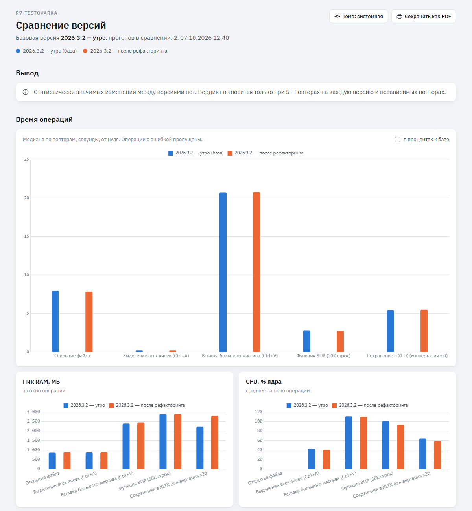
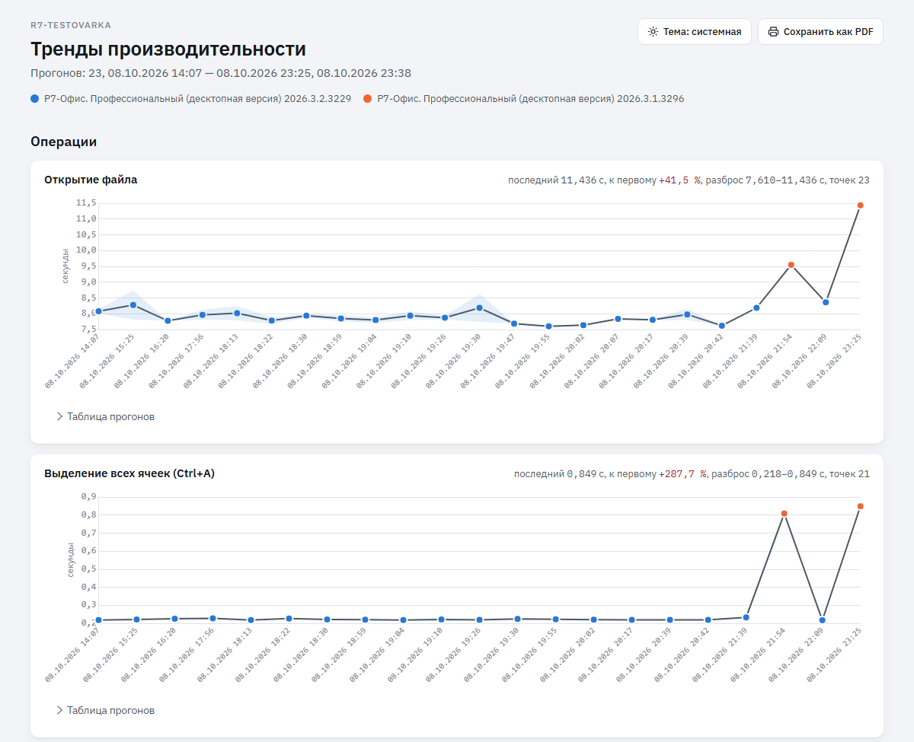

<div align="center">

# ⚡ R7-Testovarka

**Замеры производительности Р7-Офис: честные, повторяемые, сравнимые между версиями и машинами**

[](https://github.com/fedintsevqq/r7-testovarka/actions/workflows/tests.yml)
[](https://github.com/fedintsevqq/r7-testovarka/actions/workflows/build.yml)
[](https://github.com/fedintsevqq/r7-testovarka/releases/latest)




</div>

R7-Testovarka запускает Р7-Офис на рабочем файле и много раз повторяет одни и те же
операции. По каждой считает медиану и разброс, сравнивает сборки между собой и говорит,
есть ли регрессия, с интервалом и порогом, подобранным под шум вашего ПК.

Главное правило: **цифра отражает работу Р7, а не инструмента.** Свои паузы инструмент
вычитает, конец операции берёт по ответу редактора, а не по последнему нажатию клавиши,
подготовку теста делает вне замера.

## Содержание

- [Что меряется](#-что-меряется)
- [Как считаются замеры](#-как-считаются-замеры)
- [Быстрый старт](#-быстрый-старт)
- [Как пользоваться](#-как-пользоваться)
- [Режимы работы](#-режимы-работы)
- [Как читать результат](#-как-читать-результат)
- [Работа в команде](#-работа-в-команде)
- [Документация](#-документация)
- [Разработка](#-разработка)
- [Ограничения и частые вопросы](#-ограничения-и-частые-вопросы)

## 🎯 Что меряется

| Редактор | Файл | Операции |
|---|---|---|
| **Таблицы** | `TestFiles/r7-test-50k.xlsx`, 50 000 строк × 50 столбцов | открытие; Ctrl+A, Ctrl+C, вставка большого массива, новый лист, добавление и удаление столбца, вставка 1 и 5 ячеек (клавишами и через ПКМ), ВПР на 50K строк; экспорт в PDF, ODS, CSV, XLTX — всего 17 тестов |
| **Документы** | `TestFiles/r7-test-doc-100p.docx`, ~100 страниц | открытие, вставка 100 страниц, смена стиля всего документа, поиск и замена, экспорт в PDF и DOCX |
| **Презентации** | `TestFiles/r7-test-slides-50.pptx`, 50 слайдов | открытие, добавление 50 слайдов, дублирование всех слайдов, смена темы, переход ко всем слайдам, экспорт в PDF и PPTX |

Тестовые файлы создаёт сам инструмент. Свои тесты можно добавить файлом в `plugins/`
без правки кода инструмента ([`docs/plugins.md`](docs/plugins.md)).

Как именно считается каждая цифра — [следующий раздел](#-как-считаются-замеры).

## ⏱ Как считаются замеры

Главное правило — **цифра отражает работу Р7, а не инструмента**. Из него следует всё
остальное:

- Секундомер — `time.perf_counter()`. Он стартует только когда Р7 простаивает: перед
  каждым повтором инструмент ждёт 0,3 с тишины редактора, чтобы хвост прошлой операции
  (отрисовка, агрегаты статусной строки) не попал в следующий замер.
- **Подготовка теста** (рабочий лист, выделение, буфер обмена, свежий лист под вставку)
  и **откат правки** между повторами идут **вне замера**. В замере остаётся одно
  действие.
- Если инструменту нужна пауза, чтобы Р7 успел за клавиатурой (открылось меню, висит
  модалка), вычитается только та её часть, когда Р7 действительно простаивал.
  «Спящих» пауз внутри замера нет.
- Ресурсы (пик RAM, среднее CPU, диск) снимаются за окно операции параллельно и на
  время не влияют. Метрики интерфейса (первый кадр, самая долгая блокировка, JS-куча)
  собираются после конца операции.

### Открытие файла

Перед каждым открытием сбрасывается файловый кэш Windows (нужны права администратора;
без них отчёт это помечает). Время делится на две фазы: **запуск Р7** — от старта
процесса до появления окна, **загрузка документа** — от окна до готовности. Каждый
повтор — независимый холодный старт, поэтому первый повтор здесь не отбрасывается
(по умолчанию 5 повторов, медиана).

Что считается «документ готов», зависит от редактора:

| Редактор | Признак готовности | Почему именно так |
|---|---|---|
| **Таблица** | кнопка «Жирный» на панели стала доступной. Внутри страницы редактора ставится наблюдатель (через CDP), который отмечает момент включения кнопки; кнопка должна простоять доступной 0,5 с. Параллельно общий детектор следит, что окно отзывчиво (отвечает быстрее 300 мс) и процессы Р7 простаивают: CPU ниже 25 % одного ядра 20 опросов подряд по 0,15 с, конвертер x2t не запущен | в таблицах кнопка включается, когда данные загружены: это и есть конец загрузки с точностью до шага наблюдателя. Без CDP готовность берётся по простою CPU (маркер `cpu`, точность хуже) |
| **Документ** | кнопка «Жирный» **плюс досчёт вёрстки**. Большой документ верстается порциями по таймеру уже после того, как кнопка включилась, поэтому одной кнопки мало. После неё инструмент читает состояние редактора каждые 0,05 с: идёт пересчёт (`FullRecalc`) — ждём; пересчёт закончен — готово; если поле не читается — готово, когда число страниц не меняется два чтения подряд. Момент готовности сдвигается на первое чтение итогового состояния, маркер в отчёте — `bold+layout` | иначе на документе в сотни страниц «открытие» заканчивалось бы за секунды, а вёрстка шла бы ещё десятки секунд. Если за 60 с вёрстка не досчиталась, открытие записывается как верхняя оценка с маркером `bold+layout_timeout`; на фикстуре в 100 страниц живьём укладывается, на документах в тысячу страниц лимит не проверялся |
| **Презентация** | кнопка «Добавить слайд» плюс тот же досчёт: число слайдов не меняется два чтения подряд по 0,05 с | «Жирный» в презентации доступен только при курсоре в тексте, а после открытия выделен слайд. Признака идущего пересчёта у презентации нет. Миниатюры слайдов рисуются по таймеру уже после готовности — их работу видит пинг редактора, и в первый замер правки они не попадают |

### Операции правки

Операции идут через api редактора по CDP (порт отладки 8080). Один вызов — одна
операция; `api_ms` в отчёте — синхронное время этого вызова. Но основная работа часто
идёт после возврата из api (вставка 50 000 строк: 2 с внутри вызова, 20 с вся операция),
поэтому главная цифра — `time`, конец операции по тишине редактора:

| Редактор | Конец операции |
|---|---|
| **Таблица** | редактор 0,3 с подряд отвечает на пинг быстрее 10 мс (опрос каждые 0,05 с). Точность около 1 мс |
| **Документ и презентация** | сначала досчёт вёрстки (та же проверка, что при открытии, шаг 0,05 с), затем тишина пинга. Так в замер попадает хвост вёрстки после последней порции, а паузы между порциями не заканчивают замер раньше времени |
| **Без CDP (клавиши)** | простой CPU процессов Р7: занято — от 25 % одного ядра (одно окно от 60 %), окно усреднения 0,2 с, свободно 6 опросов подряд (0,3 с). Точность ±0,2 с. Если за 1 с Р7 так и не стал занятым, повтор получает статус `below_floor` — операция быстрее, чем можно измерить клавишами |

После каждого повтора инструмент **проверяет результат** по состоянию документа
(сдвинулась ли история правок, выделен ли весь лист, добавился ли лист или слайд).
Если проверка не прошла, повтор получает статус `unverified` и в медиану не входит.
Операция, которая должна была изменить документ, но не изменила, — ошибка теста, а не
цифра. Предохранитель — 180 с на операцию (у Ctrl+A — 20 с): дольше — статус
`timeout`, повтор в медиану не входит.

Повторы независимы: правка откатывается через историю редактора, а у «Вставки большого
массива» лист вставки удаляется целиком (отмена 2,5 млн ячеек шла 20 с), и следующий
повтор получает новый лист. Между повторами инструмент снова ждёт простоя Р7.

### Экспорт

Старт — нажатие «Сохранить» в диалоге «Сохранить как». Всё до него (открыть диалог,
переключить тип файла, набрать путь) — работа инструмента и в замер не входит; если
Р7 показывает окно и ждёт ответа (предупреждение о потере формата, параметры CSV),
это ожидание вычитается. Конец — **время последней записи файла** на диск: размер
файла не меняется 8 опросов подряд по 0,05 с, берётся `mtime`. Предохранитель 120 с.
Формат записанного файла проверяется по содержимому, а не по расширению. Падение
конвертера x2t — ошибка с его кодом возврата, а не цифра.

### Повторы и статистика

- По умолчанию: правка — 7 повторов, открытие — 5, экспорт — 3, Batch — 6.
- Первый повтор правки отбрасывается как прогрев, если после него остаётся хотя бы
  три. Итог — **медиана** по годным повторам и **MAD** (медианное отклонение) как мера
  разброса; `avg`/`min`/`max` в JSON сохранены для совместимости.
- Статусы повтора: `ok`, `below_floor`, `timeout`, `unverified`. В медиану входят
  только `ok` и `below_floor`.
- **Добор повторов.** Если 95 %-интервал медианы шире половины порога теста,
  инструмент добавляет повторы, но не больше заказанных × 2 и не тогда, когда время
  монотонно ползёт от повтора к повтору (тогда добор лишь сдвинул бы медиану).
- Повтор, во время которого частота CPU падала ниже 80 % номинальной, помечается
  «троттлинг», но в медиану входит.
- Помехи — фоновая загрузка CPU, работа от батареи, чужое окно в фокусе, другая
  программа в буфере обмена — идут в плашку «Условия прогона» отчёта.

Пороги и формулы — [`docs/measurement.md`](docs/measurement.md),
[`docs/precision.md`](docs/precision.md), [`docs/readiness.md`](docs/readiness.md),
[`docs/document-ops.md`](docs/document-ops.md),
[`docs/presentation-ops.md`](docs/presentation-ops.md); как из медиан получается
вердикт — [`docs/statistics.md`](docs/statistics.md).

## 🚀 Быстрый старт

**Что нужно:** Windows 10 или 11, Р7-Офис 2026.x. Права администратора желательны: без
них замеры идут, но кэш Windows перед открытием не сбрасывается (отчёт это помечает) и
версии Р7 не ставятся.

### Вариант 1. Готовый архив (без Python)

1. Скачайте `R7-Testovarka-<версия>-win64.zip` из
   [последнего релиза](https://github.com/fedintsevqq/r7-testovarka/releases/latest).
2. Распакуйте в папку на локальном диске (не в `Program Files`).
3. Если будете ставить и сравнивать версии Р7, положите дистрибутивы (`.msi` или `.exe`
   с номером сборки в имени, например `r7-office_2026.3.2.3229_x64.exe`) в папку
   `Distributives\` рядом с `.exe`. Для одного замера установленной версии они не нужны.
4. Запустите `R7-Testovarka.exe` от имени администратора. Файл не подписан (инструмент
   раздаётся внутри команды), SmartScreen может спросить «Выполнить в любом случае».

Пошагово, с проверкой хеша — [страница первого запуска](docs/rollout/README-first-run.md).
Командная строка `python -m r7` в `.exe` не входит, для неё нужен вариант 2.

### Вариант 2. Из исходников

Нужен Python 3.11–3.14 (64-бит).

```bat
git clone https://github.com/fedintsevqq/r7-testovarka.git
cd r7-testovarka
python -m venv .venv
.venv\Scripts\python.exe -m pip install --require-hashes -r requirements.lock
.venv\Scripts\python.exe r7_Testovarka.py
```

Версии пакетов зафиксированы в `requirements.lock` вместе с хешами, список зависимостей —
`requirements.in`. Двойной щелчок по `r7_Testovarka.py` тоже работает: если файл открыл
системный Python без нужных пакетов, программа сама перезапустится под `.venv`. Как
собрать `.exe` — [`BUILD.md`](BUILD.md).

### Первый запуск

Программа сама проверяет стенд и показывает список: сборка, права, Р7-Офис найден (если
нет, то где искали), Р7 закрыт, порт CDP свободен, тестовый файл на месте, свободное
место, масштаб экрана, пакеты Python. Красные пункты мешают прогону, жёлтые попадут в
«Условия прогона» отчёта. Исправили, нажали «Повторить проверку». Флажок «Больше не
показывать» пишет `"first_run_done": true` в `r7_settings.json` рядом с программой.

В том же файле задаются настройки этой машины:

| Ключ | Что значит |
|---|---|
| `r7_path` | путь к `DesktopEditors.exe`, важнее реестра |
| `reports_folder` | папка отчётов вместо `Reports/` |
| `default_runs` | повторы по умолчанию |
| `team_reports_folder` | общая папка команды (см. [Работа в команде](#-работа-в-команде)) |
| `manage_power_plan` | на время прогона включать план питания «Высокая производительность» (по умолчанию да) |
| `trace_on_regression` | после `python -m r7 run` снимать трассу с регрессий |
| `plugins_enabled` | загружать тесты из `plugins/*.py` |

Подробнее: [`docs/first-run.md`](docs/first-run.md). Та же проверка без окна —
`python -m r7 check`.

**Рабочий файл таблиц** — `TestFiles/r7-test-50k.xlsx`. Нет его — создайте кнопкой
«Тестовые файлы»: при размере 50 000 × 50 генератор сам даст это имя. Прежнее имя
`файл-для-теста-Р7-офис-50К.xlsx` программа тоже узнаёт.

**Первый прогон:** закройте Р7-Офис → вкладка «Производительность» → отметьте тесты →
«Запустить выбранные тесты». Пока идёт прогон, не трогайте клавиатуру и мышь:
инструмент работает с окном Р7. Аварийный выход — увести мышь в левый верхний угол
экрана.

## 🧭 Как пользоваться

### Что где лежит

Всё, с чем работает программа, лежит в папках **рядом с `R7-Testovarka.exe`** (или рядом с
`r7_Testovarka.py`, если запуск из исходников). По всему компьютеру она ничего не ищет.

```
R7-Testovarka.exe
Distributives\   дистрибутивы Р7 (.msi и .exe); другие папки — кнопкой «Папка…»
TestFiles\       тестовые файлы: таблица, документ, презентация (создаются сами)
Reports\         отчёты (HTML, JSON, Excel) и журнал Reports\logs\r7-testovarka.log
r7_settings.json  настройки этой машины (появится после первого запуска)
```

- **Установленный Р7-Офис** программа находит сама — по реестру Windows. Стоит
  нестандартно и не нашёлся — впишите путь к `DesktopEditors.exe` в `r7_settings.json`,
  ключ `r7_path`.
- **Дистрибутивы** нужны, только если вы хотите ставить и сравнивать версии. Три
  способа, все на вкладке «Версии»:
  - положить `.msi` или `.exe` в `Distributives\` и нажать «Обновить» (или «Файл…» —
    программа скопирует выбранный файл в эту папку);
  - **«Папка…»** — указать любую папку, в том числе сетевую папку команды, где
    лежат сборки. Файлы не копируются (каждый по 430–630 МБ), папка запоминается в
    `r7_settings.json` (`distributives_dirs`), в таблице видно, откуда файл;
  - **«Найти в Загрузках»** — программа найдёт `r7-office*.exe/.msi` в «Загрузках» и на
    «Рабочем столе» (на два уровня вглубь) и предложит добавить эти папки.

  Номер сборки в имени файла обязателен (`r7-office_2026.3.2.3229_x64.exe`): по нему
  строится список, Batch и бисект. **Перед установкой проверяется цифровая подпись:**
  ставятся только файлы, подписанные АО «Р7». Неподписанный, подменённый или
  недокачанный файл отклоняется с объяснением в журнале.

### Замерить установленную версию

1. Закройте Р7-Офис.
2. Вкладка «Производительность» → сверху выберите редактор: таблица, документ или
   презентация. Файл для документа и презентации программа создаст сама. Для таблиц в
   первый раз нажмите «Тестовые файлы» и создайте файл 50 000 × 50: под
   переключателем редактора видно, найден ли файл.
3. Отметьте тесты (по умолчанию отмечены все, кроме дополнительных экспортов в ODS, CSV
   и XLTX) и нажмите «Запустить выбранные тесты».
4. Не трогайте мышь и клавиатуру, пока идёт прогон: программа работает с окном Р7.
   Полный прогон таблиц — 15–20 минут, документы и презентации — 2–3 минуты.
5. В конце появится окно «Тест завершён» с кнопкой открыть отчёт. HTML-отчёт, полный
   JSON и Excel лежат в `Reports\`.

### Сравнить две версии

- **Batch (сам ставит версии).** Нужны права администратора и дистрибутивы в
  `Distributives\`. Кнопка «Batch-режим» → отметьте версии → «Запустить». Программа по
  очереди удалит текущую версию, поставит следующую, прогонит тесты; галочка A-B-A в
  конце ещё раз поставит первую версию, чтобы проверить, что стенд не «поплыл». На
  каждую версию — около 15 минут для таблиц. После Batch установлена последняя версия
  списка (или первая, если включён A-B-A).
- **Вручную.** Замерьте текущую версию, поставьте другую на вкладке «Версии» (двойной
  щелчок по строке), замерьте её.

Потом «Сравнить версии» → отметьте два и более отчёта → «Сравнить». Страница покажет
вердикт по каждой операции: регрессия, ускорение, эквивалентно или «не определено».

### Чтобы вердикты были точнее

Порог регрессии по умолчанию — 10 %. Точнее он становится, когда на этом ПК снят
профиль шума: две серии замеров одной и той же версии подряд
(`tests/nightly_local.py --aa`, запуск из исходников, ~30 минут). После этого у каждой
операции свой порог по реальному разбросу этого ПК.

## 🖥 Режимы работы

Одновременно идёт только один прогон: все режимы работают с одним процессом Р7.

| Режим | Где | Что делает |
|---|---|---|
| Прогон тестов | вкладка «Производительность» | выбранные тесты, у каждого своё число повторов (открытие 5, правка 7, экспорт 3); «Остановить» прерывает между операциями, отчёт по сделанному сохраняется |
| Документ или презентация | переключатель редактора на вкладке «Производительность» | тот же прогон на `.docx` или `.pptx`: свои тесты и повторы, фикстура создаётся сама |
| Версии | вкладка «Версии» | установленная версия из реестра, дистрибутивы из `Distributives/`, тихая установка и удаление, проверка хеш-сумм |
| Batch | кнопка «Batch-режим» | те же тесты по нескольким версиям подряд: удалить → поставить → замерить; редактор — таблица, документ или презентация; галочка «Повторить базовую версию в конце (A-B-A)» ловит дрейф стенда |
| Свой файл | кнопка «Тестовые файлы» | генератор xlsx от 1 000 до 1 000 000 строк с профилями нагрузки; «Протестировать» меряет открытие и ВПР на любом файле |
| Сценарии | вкладка «Сценарии» | soak (одна операция десятки минут, дрейф и утечки памяти), несколько документов в одном Р7, восстановление после падения |
| Сравнение и тренды | кнопки «Сравнить версии», «Тренды» | 2–8 отчётов на одной странице с вердиктами; история каждой операции с точками смены уровня |
| Наборы и вердикт релиза | `python -m r7 run` | набор тестов из `suites/*.toml` с бюджетами, страница «Релиз готов / Не готов», JUnit XML и код выхода для CI |
| Корпус | `python -m r7 corpus` | открытие, пересчёт и экспорт каждого реального файла из `Corpus/`, матрица «файл × версия» |
| Бисект | `python -m r7 bisect` | ставит сборки по очереди и находит первую, на которой операция стала медленнее |
| Трасса | `python -m r7 trace`, `run --trace-regressions` | отдельный повтор вне замера с трассой для Perfetto и профилем V8 |
| Ночной прогон | `tests/nightly_local.py` | ключевые тесты и сравнение с базой из пяти прошлых ночей; `--aa` снимает профиль шума стенда |



### Командная строка

Р7-Офис должен быть закрыт. Все команды с описанием аргументов — [`docs/cli.md`](docs/cli.md).

```bat
.venv\Scripts\python.exe -m r7 check
.venv\Scripts\python.exe -m r7 suites
.venv\Scripts\python.exe -m r7 run --suite suites\smoke.toml --gate --junit Reports\junit.xml
.venv\Scripts\python.exe -m r7 run --suite suites\release.toml --baseline Reports\baseline\performance_full_20261007_120000.json --gate --trace-regressions
.venv\Scripts\python.exe -m r7 trace --op "Вставка большого массива (Ctrl+V)"
.venv\Scripts\python.exe -m r7 bisect --good 2026.3.2 --bad 2026.3.5 --op "Вставка большого массива (Ctrl+V)"
.venv\Scripts\python.exe -m r7 corpus --formats pdf,xlsx
.venv\Scripts\python.exe -m r7 corpus-compare Reports\corpus_20261007_120000.json Reports\corpus_20261009_120000.json
```

| Набор | Что в нём | Время |
|---|---|---|
| `suites/smoke.toml` | открытие и три ключевые операции таблиц | ~5 мин |
| `suites/release.toml` | все 17 тестов таблиц с бюджетами | ~45 мин |
| `suites/export.toml` | четыре экспорта через x2t | ~20 мин |
| `suites/docs.toml` | документ .docx: открытие, три правки, два экспорта | ~2 мин |
| `suites/slides.toml` | презентация .pptx: открытие, четыре правки, два экспорта | ~2 мин |

Коды выхода `run`: 0 — релиз готов, 1 — не готов (бюджет или регрессия), 2 — прогон
не удался или прерван, 3 — ошибка набора или стенда. `--gate` пишет `gate_<время>.html`, `--junit` —
JUnit XML для CI. Перед командой можно поставить `--no-plugins`: тогда идут только тесты
поставки.

Бисекту нужны права администратора: он ставит и удаляет версии тем же путём, что Batch,
а в конце возвращает исходную.

## 📑 Как читать результат

После прогона в `Reports/` появляются три файла:

| Файл | Зачем |
|---|---|
| `Performance_Report_<время>.html` | страница для человека: плитки, график, таблица, детали повторов |
| `Performance_Report_<время>.xlsx` | те же данные в Excel |
| `performance_full_<время>.json` | полные данные для сравнения, трендов и пакета улик |



**Одна операция.** Время — медиана повторов, разброс — MAD (медианное абсолютное
отклонение). Первый повтор считается прогревом и отбрасывается, если после него
остаётся хотя бы три. Повторы с таймаутом (180 с) и неподтверждённые (редактор не
сообщил, что документ изменился) в медиану не входят.

| Метка у операции | Значит |
|---|---|
| `таймаут×N` | Р7 не освободился за 180 с |
| `без подтверждения×N` | редактор не подтвердил, что операция выполнилась |
| `зависимые повторы` | правку не удалось откатить, следующий повтор шёл на изменённом документе |
| `<порога` | операция быстрее, чем можно измерить клавишами |
| `диск` | открытие замедлил медленный диск с папкой данных Р7 |
| `троттлинг×N` | частота CPU в повторе падала ниже 80 % (повтор в медиану входит) |

Жёлтая плашка «Условия прогона» перечисляет помехи: фоновая загрузка, работа от
батареи, мало места, чужое окно перехватило фокус, другая программа записала в
буфер обмена.

### Сравнение двух сборок



Изменение записывается как «+12 % [+7; +18]»: сдвиг медианы и его 95-процентный
интервал. Вердикт ставится по интервалу и **порогу теста**:

- **Порог** = `max(3 × CV, 2 %)`, где CV — шум этого теста на этом ПК из A/A-прогона
  (`tests/nightly_local.py --aa`, файл `Reports/noise_profile.json`). Без профиля шума
  порог 10 %.
- **Поправка на число тестов** (Бенджамини-Хохберг): при 17 сравнениях без неё ложная
  тревога выпадала бы в каждом втором прогоне.

| Вердикт | Когда |
|---|---|
| РЕГРЕССИЯ / УСКОРЕНИЕ | весь интервал за порогом, p после поправки < 0,05 |
| вероятная регрессия / вероятное ускорение | интервал за порогом, p прошёл до поправки, но не после. Повод перемерить, не тревога: «Не готов» не ставит |
| эквивалентно | весь интервал внутри ±порога |
| не определено | интервал пересекает порог — повторов мало, чтобы сказать |

В отчёте есть и строка «7 повторов ловят сдвиг от N %»: меньший сдвиг этим числом
повторов не увидеть. Если прогон шумнее обычного, инструмент сам добирает повторы, пока
интервал медианы не станет уже половины порога (не больше заказанных × 2), и не добирает,
когда время ползёт от повтора к повтору. Формулы — [`docs/statistics.md`](docs/statistics.md).

**Когда сравнивать нельзя.** Страница предупреждает в двух случаях:

- **«другой стенд»** — отчёты сняты на машинах с разным отпечатком (CPU, RAM, ОС,
  масштаб, диск, план питания). Разница может быть разницей ПК, а не сборок. Ночной
  контур такую регрессию тревогой не считает.
- **разные схемы замера** (`measure_schema`, сейчас 11) — методика менялась, цифры
  несравнимы ([`docs/adr/0003-measure-schemas.md`](docs/adr/0003-measure-schemas.md)).

### Тренды



История каждой операции по всем прогонам, с полосой разброса и фильтром по машине.
Если уровень ряда сдвинулся, на графике отметка «сдвиг с <сборка>, +N %».

## 👥 Работа в команде

- **Общая папка.** Укажите в `r7_settings.json` ключ `team_reports_folder` (сетевая
  папка). После каждого прогона JSON и HTML копируются туда в подпапку
  `<имя ПК>-<отпечаток>`. Тренды и окно сравнения читают все подпапки, на странице
  трендов есть фильтр по машине.
- **Один ПК — одна база.** Порог из шума и «другой стенд» работают по отпечатку
  машины. Сравнивайте сборки на одном ПК; сравнение между ПК — только как ориентир.
  Профиль шума снимают один раз на каждом ПК: `tests/nightly_local.py --aa --quick`.
- **Пакет улик.** В окне «Сравнить версии» отметьте два отчёта (база и проверяемая
  сборка) и нажмите «Пакет улик». Получится `Reports/evidence/evidence_<время>.zip`:
  оба JSON, страница сравнения, окружение, хвост журнала, файлы трассы, если она
  снималась, и `ticket.md` — готовый текст тикета с заголовком «Регрессия <операция>:
  <база> → <проверяемая> (+N %)», сборками, стендом, шагами и таблицей цифр.
- **Перед раздачей на новые ПК** — чеклист [`docs/rollout-checklist.md`](docs/rollout-checklist.md).

## 📚 Документация

| Файл | О чём |
|---|---|
| [`docs/first-run.md`](docs/first-run.md) | мастер первого запуска, `r7_settings.json`, режим без прав |
| [`docs/cli.md`](docs/cli.md) | `python -m r7`: наборы, бюджеты, вердикт релиза, трасса, бисект |
| [`docs/statistics.md`](docs/statistics.md) | шум стенда, порог, интервал, поправка, вердикты |
| [`docs/ui-and-reports.md`](docs/ui-and-reports.md) | окно, отчёты, отпечаток машины, общая папка, тренды, A-B-A, сценарии, пакет улик |
| [`docs/measurement.md`](docs/measurement.md) | как меряется операция, `_pace`, план питания и частота CPU |
| [`docs/precision.md`](docs/precision.md) | разбор точности: конец операции по пингу, подготовка тестов, диск |
| [`docs/readiness.md`](docs/readiness.md) | когда документ считается открытым |
| [`docs/cdp-operations.md`](docs/cdp-operations.md) | операции через api редактора, проверка результата, трасса |
| [`docs/ui-fallback.md`](docs/ui-fallback.md) | запасные пути через интерфейс без CDP |
| [`docs/closing-and-dialogs.md`](docs/closing-and-dialogs.md) | закрытие Р7 и блокирующие диалоги |
| [`docs/versions.md`](docs/versions.md) | установка и удаление версий, ключи тихой установки, UAC |
| [`docs/document-ops.md`](docs/document-ops.md) | тесты документов .docx |
| [`docs/presentation-ops.md`](docs/presentation-ops.md) | тесты презентаций .pptx |
| [`docs/corpus.md`](docs/corpus.md) | корпус реальных файлов, правила обезличивания |
| [`docs/plugins.md`](docs/plugins.md) | свой тест файлом в `plugins/` |
| [`docs/rollout-checklist.md`](docs/rollout-checklist.md) | проверка сборки на чистых ПК |
| [`docs/ci-runner.md`](docs/ci-runner.md) | раннер CI на стенде с Р7 |
| [`docs/adr/`](docs/adr/README.md) | архитектурные решения: CDP вместо клавиш, порт 8080, схемы замера, `_pace`, статистика |
| [`docs/plan-to-20.md`](docs/plan-to-20.md) | план развития и статус |
| [`CHANGELOG.md`](CHANGELOG.md) | что менялось по версиям |
| [`BUILD.md`](BUILD.md) | сборка `.exe`, SBOM и лицензии, подпись |

Схема архитектуры: [`docs/diagrams/architecture.html`](docs/diagrams/architecture.html).
Правила для разработчика и карта кода — [`CLAUDE.md`](CLAUDE.md).

## 🛠 Разработка

```bat
.venv\Scripts\python.exe -m pip install --require-hashes -r requirements-dev.lock
```

| Проверка | Команда | Время |
|---|---|---|
| Юнит-тесты (2 300+, Р7 не нужен) | `.venv\Scripts\python.exe -m pytest -q` | ~70 с |
| Линтер | `.venv\Scripts\python.exe -m ruff check .` | секунды |
| Типы (модули — `[tool.mypy]` в `pyproject.toml`) | `.venv\Scripts\python.exe -m mypy` | секунды |
| Живой набор на установленном Р7 | `set R7_LIVE=1` и `.venv\Scripts\python.exe -m pytest -m live tests/live -v` | ~1,5 мин |
| Быстрый ночной прогон со сравнением | `.venv\Scripts\python.exe tests/nightly_local.py --quick` | ~8 мин |

- В юнит-тестах есть свойства статистики на Hypothesis (`tests/test_stats_properties.py`)
  и эталонные HTML-отчёты (`tests/test_golden_reports.py`; `R7_UPDATE_GOLDEN=1`
  переписывает эталоны).
- **CI на GitHub:** юнит-тесты на Python 3.11 и 3.14, `pip-audit`, ruff, mypy, покрытие
  не ниже 85 %, сборка `.exe` с самопроверкой, SBOM и список лицензий.
- Windows-вызовы (`win32*`, реестр, `pywinauto`, `ctypes.windll`) — только в
  `r7/windows.py`, `r7/env.py`, `r7/versions.py`, `r7/x2t_files.py`. Новый вызов в
  другом модуле не пропустит `tests/test_platform_boundary.py`: так готовится порт на
  Linux и macOS.
- PR, задевающий прогон, проходит живой набор.

> [!CAUTION]
> Не запускайте живые прогоны и юнит-тесты одновременно: тесты интерфейса создают окна Tk и
> могут увести фокус у окна Р7. Перед живым прогоном закройте Р7-Офис.

## ❓ Ограничения и частые вопросы

**Известные ограничения**

- **Только Windows.** Linux и macOS — в планах, код к порту готовится.
- **Документы и презентации** запускаются из вкладки «Производительность»
  (переключатель редактора) и из командной строки (`suites/docs.toml`,
  `suites/slides.toml`). Batch, трасса регрессий и UX-метрики работают для всех трёх
  редакторов, бисект пока только для таблиц.
- **Экспорт рабочего файла в ODS** роняет конвертер x2t: ему не хватает встроенного
  лимита памяти. Это баг Р7 (DE-8304), инструмент только фиксирует падение.
- **Открытие зависит от диска** с папкой данных Р7 (`%LOCALAPPDATA%\R7-Office`). На
  медленном диске часть открытий идёт заметно дольше, такие повторы помечены «диск».
- **Без пакетов `requests` и `websocket-client`** нет CDP. Тесты тогда идут клавишами,
  их цифры несравнимы с обычным прогоном, а тесты через контекстное меню не выполняются.
- **`.exe` не подписан:** инструмент раздаётся только внутри команды, сертификат не
  нужен. Шаг подписи в сборке есть и включится, если его заведут.

**Если что-то пошло не так**

| Что видно | Что делать |
|---|---|
| В журнале `WEBDRIVER_OK=False` | пакеты стоят не в том Python: `.venv\Scripts\python.exe -c "import requests, websocket"` |
| «Р7 уже запущен» | закройте Р7-Офис: к открытому процессу инструмент не подключается |
| Операция «зависла» | через 180 с она получит метку «таймаут», и прогон пойдёт дальше |
| В сравнении «другой стенд» | отчёты сняты на разных ПК; перемерьте обе сборки на одном |
| Вердикт «не определено» | добавьте повторов или снимите профиль шума (`--aa`) |
| Р7 остался открытым после ошибки | так не должно быть, пришлите журнал прогона |
| Программа упала или окно закрылось | пришлите `Reports/logs/r7-testovarka.log` (жёсткое падение — `crash.log` рядом) |

---

<div align="center">

Лицензия: [MIT](LICENSE) · Документация: [`docs/`](docs/) · Презентация: [`docs/slides/r7-testovarka.html`](docs/slides/r7-testovarka.html) · Сборка `.exe`: [`BUILD.md`](BUILD.md)

</div>
